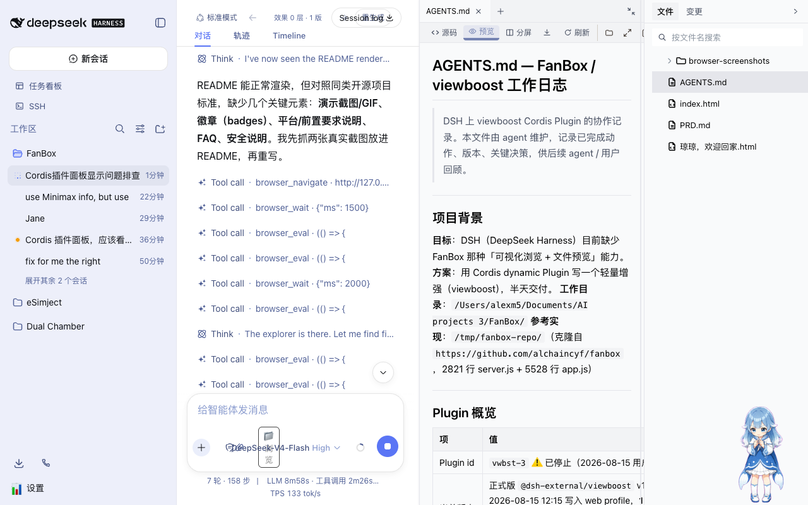
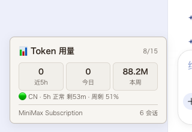

<div align="center">

# viewboost

**Preview-toolbar boost for DeepSeek Harness** — Finder reveal, fullscreen, copy path/file for the right-hand preview panel, plus a Token usage card.

[](LICENSE)
[](CHANGELOG.md)
[](#requirements)
[](https://github.com/deepseek-ai)

</div>

**viewboost** is a [DeepSeek Harness](https://github.com/deepseek-ai) plugin that adds practical file-operations buttons to the toolbar of the right-hand **aionui preview panel**, plus a lightweight **Token usage card** in the bottom-left corner.



## ✨ Features

| Button | Icon | What it does |
|---|---|---|
| 📁 Reveal in Finder | folder | Selects the currently previewed file in macOS Finder (`open -R`) |
| ⤢ Fullscreen | maximize | Expands the preview panel to fullscreen; `Esc` to exit |
| 📋 Copy path | clip | Copies the file's absolute path to the clipboard |
| ⧉ Copy file | copy | Puts a **file reference** on the macOS clipboard — paste with `Cmd+V` in Finder to copy the file |
| 📊 Token usage | — | Bottom-left card: token usage for the last 5h / today / this week, with optional MiniMax quota status line |

Toolbar icons are the feather SVG set, same style as [FanBox](https://github.com/alchaincyf/fanbox).



## 📦 Installation

> Prerequisites: a running [DeepSeek Harness](https://github.com/deepseek-ai) `web` profile.

### Option 1 — from GitHub (recommended)

```sh
dsh plugin --profile web add github:AlexCHONG8/dsh-viewboost
```

### Option 2 — from a local clone

```sh
git clone https://github.com/AlexCHONG8/dsh-viewboost.git
dsh plugin --profile web add link:/path/to/dsh-viewboost
```

After installing, **restart DSH** (`dsh web`). The plugin mounts automatically with the profile — no need to press "Run" in the Cordis panel like session-level dynamic plugins.

## 🎯 Usage

1. Open any file from the right-hand file tree → 4 icon buttons appear in the preview toolbar.
2. **📁** → Finder opens with the file selected.
3. **📋** → absolute path copied to clipboard.
4. **⧉** → file goes to the clipboard; in Finder press `Cmd+V` to paste/copy the file.
5. **⤢** → preview fullscreen; `Esc` to exit.
6. **📊** (bottom-left) → Token usage card.

### MiniMax quota (optional)

Write to `~/.dsh/viewboost.env` (permissions `0600`):

```env
MINIMAX_CN_API_KEY=sk-cp-...    # China endpoint api.minimaxi.com
# or
MINIMAX_API_KEY=sk-...          # International endpoint api.minimax.io
```

The card then shows the real Token Plan status (5h rolling window / weekly remaining, with countdown).

## 🔧 Requirements

- **DSH web profile** — plugin targets the aionui right-panel layout
- **macOS** for full feature set (Finder reveal, file-reference clipboard)
- Linux/Windows: copy-path, fullscreen and token card still work; Finder buttons degrade gracefully

## 🗂 Project structure

```
viewboost/
├── dsh.plugin.json      # DSH plugin manifest (client.main)
├── cordis.patch.yml     # bundle patch (applied on dsh plugin add)
├── package.json         # npm package + dsh.bundle/client declarations
└── lib/
    ├── index.js         # Host: /viewboost/* HTTP routes (fs / subprocess / curl)
    └── client.js        # Client: toolbar injection + Token card (module-loader wrapper)
```

## 🔌 How it works

- **Host**: `inject: ['fs', 'webServer']`; registers `/viewboost/{list,read,fileUrl,stat,thumb,binary,finder,copyfile,usage,minimax}` routes.
- **Client**: `window.__ModuleLoader__.load()` wrapper, calls the host via `fetch('/viewboost/...')`.
- **aionui integration**: a `MutationObserver` injects the buttons into the `.aionui-preview-col` toolbar; the current file path is tracked by intercepting `/aionui-panel/read|list` fetches.
- **Clipboard**: synchronous `execCommand('copy')` (offscreen textarea, same approach as the official `writeClipboard`) with a Clipboard API fallback.
- Never modifies third-party plugin source code.

## 🙏 特别致谢

灵感来自**花叔（Huashu）**的 [FanBox](https://github.com/alchaincyf/fanbox) 技能 —— 给 Agent 界面配上「可视化浏览 + 文件预览」这个设计思路，以及工具栏的 feather SVG 图标集，都源自他的作品。这个插件是我对那份灵感的手搓致敬。**感谢花叔的 FanBox，才有这份灵感。🙏**

## 📄 License

MIT — see [LICENSE](LICENSE).
